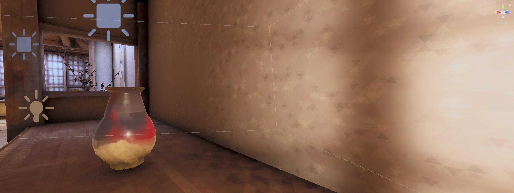
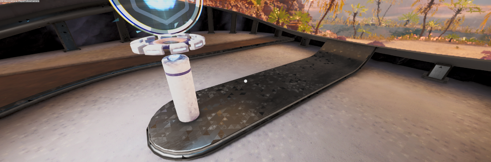

# Somnia-Fracta-AssetImporter

Somnia Fracta — a Unity editor import filter that bakes a painterly/fractal stylization directly into textures at import time. Zero runtime cost; source files are never modified.

This is intended for use in my own games, however it shows off how to perform some cool tricks, most notably running custom shader passes on incoming textures, so sharing for the educational value.

*Stylized textures in-engine — faceted walls with gasket detail, painterly surfaces, gloaming grade.*

*Spec/metallic shimmer in-engine — crystal facets catching the light across a glossy platform surface.*

## Effect

- **Painterly base** — Kuwahara oil-paint filtering, deepening where the crystal effect recedes.
- **Triangular facets** — an organically warped equilateral-triangle mosaic; facets are area-averaged fills with per-facet hue/saturation/luminance drift. No outlines.
- **Sierpinski gaskets** — a hashed minority of facets subdivide three generations deep, children shaded lighter or darker.
- **Julia crystallization mask** — a tiling orbit-trapped Julia set decides where facets emerge; mip-blurred for wide, gentle blends. Seeded per folder, so all maps of one asset align and every folder is a unique variation.
- **Gloaming grade** — soft mip-glow, lifted blacks, dusk-violet shadows, pale-gold highlights.
- **Spec/metallic shimmer** — textures assigned to `_MetallicGlossMap`/`_SpecGlossMap` material slots receive a subtle facet-aligned luminance drift (no hue, paint or grade), so the crystal facets catch the light.
- Normal maps receive the painterly pass plus a gentle facet-aligned normal tilt (no flat faceting), so facets and gaskets catch real light. Detected via importer type on every import — no scan needed.
- **Safety rails** — a content guard suppresses facets that stray across texture-atlas islands or gutters, and alpha channels pass through bit-identical to the source.

## Requirements

- Unity 2022 or Unity 6. No package dependencies.

## Usage

1. Include `-style-sf` anywhere in a texture's path (folder or file name).
2. Marked textures stylize automatically on every import: fresh imports, right-click → Reimport, Library rebuilds, platform switches.
3. For a bulk re-bake with progress dialogue and Cancel: **NKLI → Bulk Stylize Assets → Somnia-Fracta**.
4. Spec/metallic assignments are tracked live: importing or saving a material updates a classification database (cached in Library), and only the textures whose role changed re-bake automatically. The bulk run also rescans every material as a seeding/repair pass.
5. Deleting the Library rebuilds textures unstylized (the effect's caches burn with it) — the tool detects the fresh Library at startup and offers to run the bulk pass; accept, or run the menu manually.

`/hdr`, `.exr` and `.fbx` assets are excluded.

## Tuning

All dials are `const` values at the top of `Scripts/Editor/NKLITextureProcessor.cs` (facet density and drift, fractal chance/shade, mask thresholds and blur, grade tints, etc.). Constants feed a custom-dependency fingerprint, so any change invalidates stale artifacts — run the bulk menu (or reimport) to apply. When editing the shaders themselves, bump `stylizationVersion` in the same file.

## Files

- `Scripts/Editor/NKLIAssetStylizer.cs` — bulk menu, progress dialogue, coroutine pump, custom-dependency registration.
- `Scripts/Editor/NKLITextureProcessor.cs` — `AssetPostprocessor` performing the GPU pass chain; all tuning constants.
- `Resources/NKLITriangleFacet.shader` — facet mosaic and Sierpinski subdivision.
- `Resources/NKLIMuxPaintPixel.shader` — Julia mask generation and composite.
- `Resources/NKLIGloamingGrade.shader` — colour grade.
- `Resources/NKLIGammaCorrect.shader`, `Resources/NKLIBlitFlip.shader` — plumbing.
- `Resources/CameraFilterPack_*.shader` — third-party (VETASOFT) Kuwahara paint filter;
